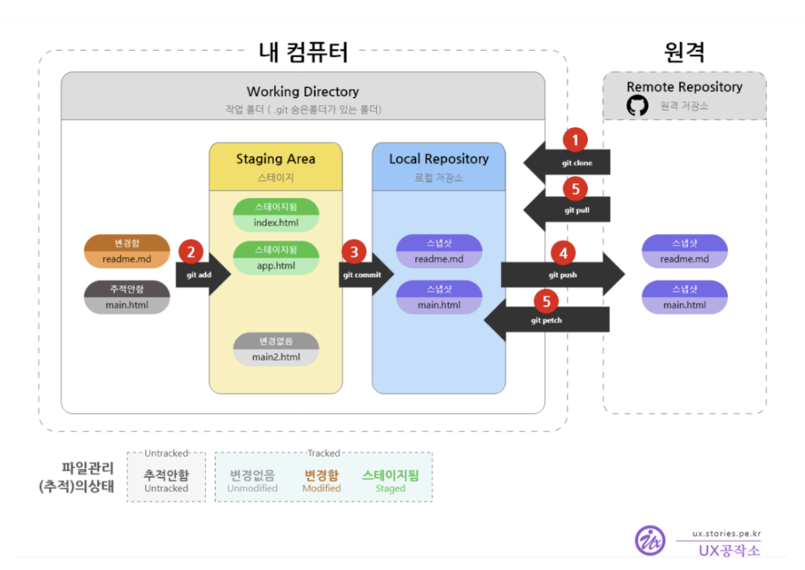

# Git

---

### Git이란?
'버전 관리 시스템'으로, 코드의 변경 사항을 시간 순서대로 저장하고 관리할 수 있음
```
대충 내가 실수를 함 -> 코드가 꼬임 -> 이전 상황으로 돌아가야함
```
이게 git이 필요한 이유

---

### Git의 주요 기능
1. 버전 관리 : 이전 상태로 어제든 돌아갈 수 있음
2. 브랜치 : 여러 버전을 독립적으로 개발하다가 필요할 때 합침(협업 때 필요)
3. 병합 : 각자 작업한 코드를 합쳐서 하나의 코드로 만듦(협업)

---

### Git의 구조



1. 로컬 저장소(Local Repository)
- 내 컴퓨터에 있는 저장소
- 각자의 로컬에서 코드 작업을 하고 Git으로 버전을 관리
- 그니깐 push 하기 전까지는 여기서 저장하고 막 가지고 놀다가 push때 올라가는 거임

2. 원격 저장소(Remote Repository)
- GitHub 같은 클라우드에 있는 저장소
- 팀원가 협업하기 위해 로컬 저장소의 내용을 원격 저장소에 업로드
- push 하면 여기로 올라가는거임 ㅇㅇ

3. 작업 디렉터리(Working Directory)
- 현재 내가 작업 중인 파일들이 있는 공간
- 파일을 수정하면 이곳에서 변경이 발생
- 내 공간

4. 스테이징 영역(Staging Area)
- 커밋하기 전, 변경된 파일을 임시로 저장하는 공간
- 'git add' 명령어로 변경 파일을 스테이징 영역에 올림

5. 로컬 저장소(Local Repository)
- 스테이징된 파일들을 '커밋(commit)' 하면 로컬 저장소에 기록됨
- 모든 커밋은 버전 히스토리로 남아 언제든 되돌릴 수 있음

### 명령어
- 블로그를 읽으면서 커밋을 할때 사용하는 명령어의 이동경로를 파악해 봤다
1. git add 파일명
    - add 파일명 =  파일명을 'add' 한다. 작업 디렉터리에 있는 코드를 선택 하는거임, 전체 파일을 'add'하고 싶으면 파일명 위치에 . 넣으면 됨
2. git commit -m ""
    - 'commit'으로 작업 디렉터리에 있던 코드를 커밋 메세지와 함께 스테이징 영역으로 이동시킴
3. git push
    - 'push'로 스테이징 영역에 있던 코드를 로컬 저장소로 올림